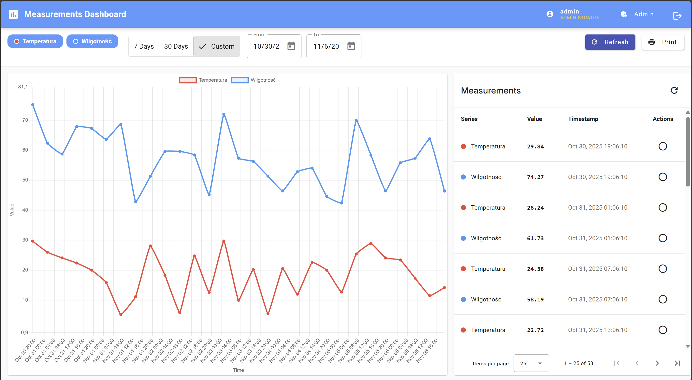
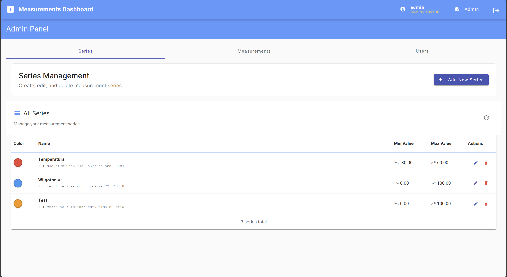
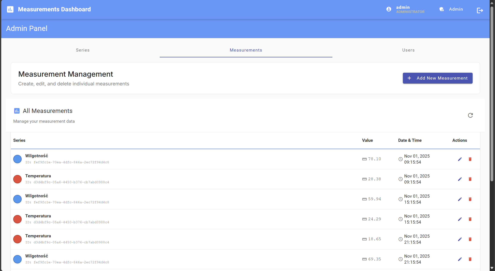
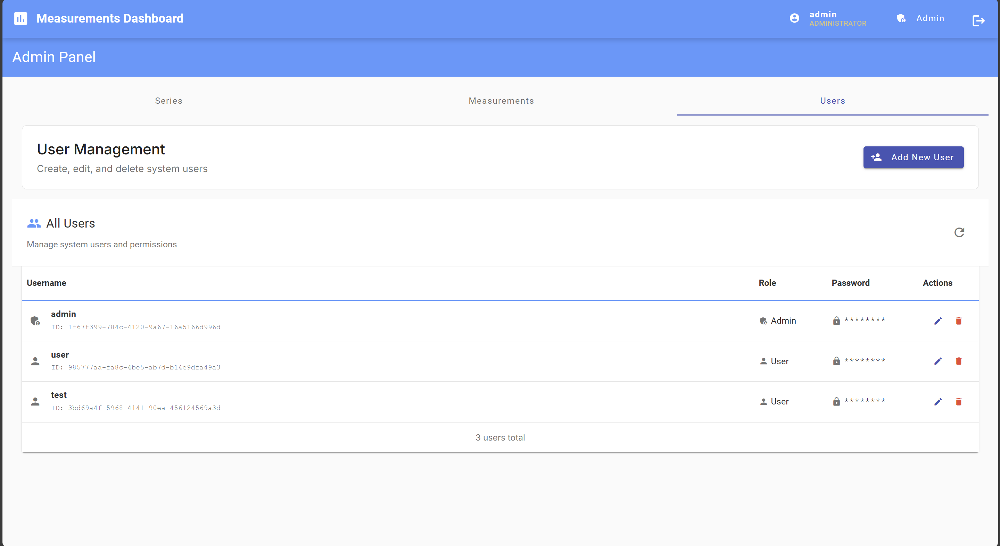
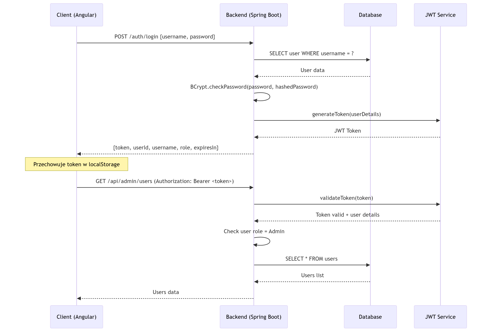

# System Zarządzania Pomiarami ZAIUZ

Kompleksowy system zarządzania danymi pomiarowymi IoT zbudowany w oparciu o technologie Spring Boot, Angular i PostgreSQL. Aplikacja zapewnia zbieranie pomiarów w czasie rzeczywistym, wizualizację danych oraz funkcje administracyjne dla danych z czujników IoT.

## Środowisko produkcyjne

Aplikacja jest dostępna w środowisku produkcyjnym na Azure VM:

**URL aplikacji:** [http://51.103.208.127](http://51.103.208.127)

**Dane testowe:**
- **Administrator**: `admin` / `123456`
- **Użytkownik**: `user` / `123456`

**Infrastruktura:**
- Azure VM: Ubuntu 24.04 LTS, 4GB RAM, 2 vCPU
- Docker Compose: 3 kontenery (Frontend + Backend + PostgreSQL)
- Nginx: Reverse proxy dla frontend i API

---


## Spis treści

1. [Przegląd](#Przegląd)
2. [Funkcjonalności](#Funkcjonalności)
3. [Architektura systemu](#architektura-systemu)
4. [Technologie i narzędzia](#technologie-i-narzędzia)
5. [Model danych](#model-danych)
6. [Dokumentacja API](#dokumentacja-api)
7. [Uwierzytelnianie i autoryzacja](#uwierzytelnianie-i-autoryzacja)
8. [Uruchomienie lokalne](#uruchomienie-lokalne)

## Przegląd

ZAIUZ to pełnowarstwowy system pomiarów IoT przeznaczony do zbierania, przechowywania i wizualizacji danych z czujników z różnych serii pomiarowych (temperatura, wilgotność, itp.). System zapewnia kontrolę dostępu opartą na rolach z oddzielnymi interfejsami dla zwykłych użytkowników i administratorów.

### Główne cechy
- **Architektura**: Aplikacja trójwarstwowa (Frontend Angular + Backend Spring Boot + PostgreSQL)
- **RESTful API**: Kompleksowe REST API z dokumentacją Swagger
- **Bezpieczeństwo**: Uwierzytelnianie i autoryzacja JWT z rolami użytkowników
- **Wizualizacja**: Interaktywne wykresy w czasie rzeczywistym
- **Responsywność**: Nowoczesny interfejs użytkownika przystosowany do urządzeń mobilnych
- **Konteneryzacja**: Pełne wsparcie Docker/Docker Compose


## Funkcjonalności

### Dashboard


Dashboard jest głównym interfejsem aplikacji, dostępnym dla wszystkich użytkowników. Stanowi centralne miejsce do wizualizacji i analizy danych pomiarowych z różnych serii czujników IoT. Interfejs został zaprojektowany z myślą o intuicyjności i responsywności, umożliwiając łatwe przeglądanie danych zarówno na komputerach stacjonarnych, jak i urządzeniach mobilnych.

**Funkcjonalności:**
- Interaktywne wykresy serii pomiarowych w czasie rzeczywistym
- Filtry czasowe (7 dni, 30 dni, okres niestandardowy)
- Selekcja serii pomiarowych do wyświetlenia
- Tabela danych z paginacją i sortowaniem
- Funkcja eksportu do druku
- Synchronizacja między wykresem a tabelą

### Panel administratora - Zarządzanie seriami


Moduł zarządzania seriami pomiarowymi jest kluczowym elementem panelu administracyjnego, umożliwiającym konfigurację i zarządzanie typami pomiarów w systemie. Administratorzy mogą definiować różne serie (np. temperatura, wilgotność, ciśnienie) wraz z ich charakterystykami, takimi jak zakresy wartości i kolory reprezentacyjne używane na wykresach.

**Funkcjonalności:**
- Lista wszystkich serii pomiarowych
- Dodawanie nowych serii z kolorami i zakresami wartości
- Edycja istniejących serii
- Usuwanie serii (z kaskowaniem powiązanych pomiarów)
- Podgląd kolorów serii


### Panel administratora - Zarządzanie pomiarami


Sekcja zarządzania pomiarami dostarcza administratorom narzędzia do bezpośredniego manipulowania danymi pomiarowymi w systemie. Umożliwia przeglądanie, dodawanie, edycję i usuwanie pojedynczych pomiarów, co jest szczególnie przydatne przy korygowaniu błędnych danych, dodawaniu pomiarów historycznych lub testowaniu systemu z przykładowymi danymi.

**Funkcjonalności:**
- Lista wszystkich pomiarów z paginacją
- Dodawanie nowych pomiarów z wyborem serii i datą
- Edycja istniejących pomiarów
- Walidacja danych dla ograniczeń serii
- Usuwanie pomiarów

### Panel administratora - Zarządzanie użytkownikami


Moduł zarządzania użytkownikami pozwala administratorom na pełną kontrolę nad kontami użytkowników w systemie. Obejmuje to tworzenie nowych kont, zarządzanie rolami i uprawnieniami, oraz administrowanie istniejącymi użytkownikami. System implementuje kontrolę dostępu opartą na rolach (RBAC), gdzie użytkownicy mogą mieć role "User" lub "Admin" z różnymi poziomami uprawnień.

**Funkcjonalności:**
- Lista wszystkich użytkowników systemu
- Dodawanie nowych użytkowników z przypisaniem ról
- Edycja danych użytkowników
- Usuwanie użytkowników
- Zarządzanie rolami (User/Admin)
- Wizualne oznaczenie ról

### Uwierzytelnianie

System uwierzytelniania zapewnia bezpieczny dostęp do aplikacji poprzez mechanizm logowania oparty na tokenach JWT. Interfejs logowania jest prosty i intuicyjny, z walidacją po stronie klienta oraz bezpiecznym przesyłaniem danych uwierzytelniających. Po pomyślnym zalogowaniu użytkownik otrzymuje token, który jest automatycznie dołączany do wszystkich żądań API.

**Funkcjonalności:**
- Formularz logowania z walidacją
- Uwierzytelnianie JWT
- Pamiętanie sesji użytkownika
- Automatyczne przekierowanie po uwierzytelnieniu

### Zmiana hasła

Funkcja zmiany hasła umożliwia zalogowanym użytkownikom bezpieczną aktualizację swoich danych uwierzytelniających. Proces jest wieloetapowy i wymaga potwierdzenia tożsamości poprzez podanie aktualnego hasła, co zapobiega nieautoryzowanym zmianom. System wymusza również silne hasła oraz ich potwierdzenie, aby zminimalizować ryzyko błędów przy wprowadzaniu nowego hasła.

**Funkcjonalności:**
- Bezpieczna zmiana hasła dla zalogowanych użytkowników
- Walidacja obecnego hasła
- Wymagania dotyczące nowego hasła
- Potwierdzenie nowego hasła

---


## Architektura systemu

Aplikacja ZAIUZ została zaprojektowana w oparciu o nowoczesną architekturę wielowarstwową, składającą się z oddzielnych, ale współpracujących ze sobą komponentów. Architektura ta zapewnia skalowalność oraz łatwość rozwoju i wdrażania. System wykorzystuje konteneryzację Docker do zapewnienia spójności środowiska oraz łatwego deploymentu.

```
┌─────────────────┐    ┌─────────────────┐    ┌─────────────────┐    ┌─────────────────┐
│     Client      │    │    Frontend     │    │     Backend     │    │    Database     │
│                 │    │                 │    │                 │    │                 │
│   Browser       │    │   Angular 20    │    │  Spring Boot 3  │    │ PostgreSQL 16   │
│   Mobile        │<-->│   Material UI   │<-->│  Java 21        │<-->│                 │
│   API           │    │   Chart.js      │    │  JWT Security   │    │ Measurement     │
│                 │    │   Nginx         │    │  Swagger API    │    │ Series          │
│                 │    │                 │    │                 │    │ Users           │
└─────────────────┘    └─────────────────┘    └─────────────────┘    └─────────────────┘
                              Port 80              Port 8080              Port 5432
```
### Architektura komponentów
#### Frontend (Angular)
```
src/
├── app/
│   ├── features/
│   │   ├── dashboard/                  # Dashboard - strona główna
│   │   │   ├── components/
│   │   │   │   ├── chart/              # Komponenty wykresów
│   │   │   │   ├── data-table/         # Tabela danych
│   │   │   │   └── filter-bar/         # Pasek filtrów
│   │   │   └── dashboard.component.ts
│   │   ├── admin/                      # Panel administratora
│   │   │   ├── components/
│   │   │   │   ├── series-form/        # Formularze serii
│   │   │   │   ├── series-table/       # Tabele serii
│   │   │   │   ├── measurement-form/   # Formularze pomiarów
│   │   │   │   ├── measurement-table/  # Tabele pomiarów
│   │   │   │   ├── user-form/          #   Formularze użytkowników
│   │   │   │   └── user-table/         # Tabele użytkowników
│   │   │   └── admin.component.ts
│   │   ├── auth/                       # Uwierzytelnianie
│   │   └── change-password/            # Zmiana hasła
│   ├── services/                       # Usługi HTTP
│   ├── guards/                         # Strażnicy tras
│   ├── interceptors/                   # Interceptory HTTP
│   └── shared/                         # Komponenty współdzielone
```

Frontend aplikacji został zbudowany w oparciu o Angular 20 z wykorzystaniem standalone components - nowoczesnego podejścia, które eliminuje potrzebę NgModules i upraszcza strukturę aplikacji. Architektura opiera się na podziale funkcjonalny (feature-based), gdzie każda główna funkcjonalność (dashboard, admin, auth) ma swój dedykowany moduł z własnymi komponentami, usługami i logiką.


#### Backend (Spring Boot)
```
src/main/java/com/zaiuz/mesurement/backend/
├── controllers/
│   ├── AuthController.java          # Uwierzytelnianie
│   ├── AdminController.java         # Operacje administracyjne
│   ├── MeasurementController.java   # API pomiarów
│   └── SeriesController.java        # API serii
├── domain/
│   ├── User.java                    # Encja użytkownika
│   ├── Series.java                  # Encja serii
│   ├── Measurement.java             # Encja pomiaru
│   └── dto/                         # Obiekty transferu danych
├── services/
│   ├── UserService.java             # Logika użytkowników
│   ├── SeriesService.java           # Logika serii
│   └── MeasurementService.java      # Logika pomiarów
├── repositories/
│   ├── UserRepository.java          # Repozytorium użytkowników
│   ├── SeriesRepository.java        # Repozytorium serii
│   └── MeasurementRepository.java   # Repozytorium pomiarów
└── security/
    ├── SecurityConfig.java          # Konfiguracja bezpieczeństwa
    ├── JwtService.java              # Usługa JWT
    └── JwtAuthFilter.java           # Filtr uwierzytelniania
```

Backend aplikacji został zaimplementowany przy użyciu Spring Boot 3.5.6 z Java 21, wykorzystując najnowsze możliwości platformy. Architektura podąża za wzrocem MVC z jasnym podziałem odpowiedzialności: Controllers obsługują żądania HTTP i dokumentację API, Services zawierają logikę biznesową, Repositories zarządzają dostępem do danych, a warstwa Security implementuje uwierzytelnianie JWT i autoryzację opartą na rolach.


System wykorzystuje Spring Data JPA do mapowania obiektowo-relacyjnego, co zapewnia wydajny i type-safe dostęp do bazy danych. Konfiguracja bezpieczeństwa oparta jest na Spring Security z customowymi filtrami JWT, które automatycznie walidują tokeny i zarządzają kontekstem bezpieczeństwa dla każdego żądania.

#### Baza danych (PostgreSQL)
- Zoptymalizowana schema: Tabele z indeksami dla szybkiej wydajności zapytań
- Przykładowe dane: Wstępnie wypełnione seriami temperatury i wilgotności
- Pola audytu: Znaczniki czasu utworzenia/aktualizacji i śledzenie użytkowników

## Technologie i narzędzia

### Backend
- Framework: Spring Boot 3.5.6
- Język: Java 21
- Bezpieczeństwo: Spring Security z JWT (jsonwebtoken 0.11.2)
- Baza danych: PostgreSQL z Spring Data JPA
- Dokumentacja: SpringDoc OpenAPI 3 (Swagger)
- Narzędzie budowania: Gradle
- Walidacja: Bean Validation (JSR-303)
- Narzędzia: Lombok, ModelMapper

### Frontend
- Framework: Angular 20.3.0
- Biblioteka UI: Angular Material 20.2.9
- Wykresy: Chart.js 4.5.1 z ng2-charts
- Stylowanie: SCSS z własnymi motywami
- HTTP: Angular HTTP Client z interceptorami
- Uwierzytelnianie: Biblioteka JWT decode
- Narzędzie budowania: Angular CLI

### Infrastruktura
- Konteneryzacja: Docker z wieloetapowymi buildami
- Serwer WWW: Nginx (do serwowania frontend)
- Baza danych: PostgreSQL 16 z trwałymi wolumenami
- Orkiestracja: Docker Compose
- Kontrole stanu: Monitorowanie stanu kontenerów
- Kontrola wersji: git + github
## Model danych

### Diagram schematyczny bazy danych

```
┌─────────────────────┐        ┌─────────────────────┐         ┌─────────────────────┐
│        USERS        │        │       SERIES        │         │     MEASUREMENTS    │
├─────────────────────┤        ├─────────────────────┤         ├─────────────────────┤
│ • id (UUID) PK      │        │ • id (UUID) PK      │         │ • id (UUID) PK      │
│ • username (TEXT)   │        │ • name (TEXT)       │         │ • series_id (UUID)  │
│ • password (TEXT)   │        │ • min_value (FLOAT) │ ------> │ • value (FLOAT)     │
│ • role (TEXT)       │        │ • max_value (FLOAT) │   1:N   │ • timestamp         │
│ • created_by        │        │ • color (TEXT)      │         │ • created_by        │
│ • created_at        │        │ • created_by        │         │ • created_at        │
│ • updated_at        │        │ • created_at        │         │ • updated_at        │
│                     │        │ • updated_at        │         │                     │
└─────────────────────┘        └─────────────────────┘         └─────────────────────┘
```

Model danych składa się z trzech głównych encji połączonych relacjami. Tabela `users` przechowuje informacje o użytkownikach systemu wraz z ich rolami i danymi audytowymi. Tabela `series` definiuje typy pomiarów z ich charakterystykami (zakresy wartości, kolory). Tabela `measurements` zawiera faktyczne dane pomiarowe powiązane z konkretną serią przez klucz obcy. Wszystkie tabele zawierają pola audytowe (created_at, updated_at, created_by) dla śledzenia zmian.


### Przykładowe dane
- Domyślni użytkownicy: admin/admin, user/user (oba z hasłem 'password')
- Domyślne serie: Temperature (-30°C do 60°C), Humidity (0% do 100%)
- Przykładowe pomiary: 7 dni przykładowych danych z 6-godzinnymi interwałami

## Dokumentacja API

API zapewnia kompleksowe punkty końcowe RESTful z pełną dokumentacją Swagger.

### Punkty końcowe uwierzytelniania
| Metoda | Punkt końcowy | Opis | Wymagane uwierzytelnianie |
|--------|---------------|------|---------------------------|
| POST | `/auth/login` | Uwierzytelnianie użytkownika | Nie |
| POST | `/auth/register` | Rejestracja użytkownika | Nie |
| POST | `/auth/logout` | Wylogowanie użytkownika | Nie |
| GET | `/auth/me` | Pobierz informacje o bieżącym użytkowniku | Tak |
| POST | `/auth/change-password` | Zmień hasło użytkownika | Tak |

### Publiczne punkty końcowe
| Metoda | Punkt końcowy | Opis | Wymagane uwierzytelnianie |
|--------|---------------|------|---------------------------|
| GET | `/api/series` | Pobierz wszystkie serie pomiarowe | Nie |
| GET | `/api/series/{id}` | Pobierz konkretną serię | Nie |
| GET | `/api/measurement` | Zapytaj o pomiary (z filtrami) | Nie |

### Punkty końcowe administratora (Wymagana rola Admin)
| Metoda | Punkt końcowy | Opis |
|--------|---------------|------|
| POST | `/api/admin/series` | Utwórz nową serię |
| PUT | `/api/admin/series/{id}` | Aktualizuj serię |
| DELETE | `/api/admin/series/{id}` | Usuń serię |
| POST | `/api/admin/measurements` | Utwórz pomiar |
| PUT | `/api/admin/measurements/{id}` | Aktualizuj pomiar |
| DELETE | `/api/admin/measurements/{id}` | Usuń pomiar |
| GET | `/api/admin/users` | Pobierz wszystkich użytkowników |
| POST | `/api/admin/users` | Utwórz użytkownika |
| PUT | `/api/admin/users/{id}` | Aktualizuj użytkownika |
| DELETE | `/api/admin/users/{id}` | Usuń użytkownika |

### Funkcje API

- Paginacja: Wszystkie punkty końcowe list obsługują paginację z parametrami `page`, `size` i `sort`
- Filtrowanie: Zapytania o pomiary obsługują filtrowanie według `seriesIds`, zakresów dat `from` i `to`
- Walidacja: Walidacja żądań z szczegółowymi komunikatami błędów
- CORS: Skonfigurowane dla pochodzenia frontend z odpowiednimi nagłówkami
- Dokumentacja: Interaktywny Swagger UI pod adresem `/swagger-ui.html`

# Uwierzytelnianie i autoryzacja

### Implementacja JWT

System używa tokenów JWT (JSON Web Tokens) do bezstanowego uwierzytelniania użytkowników. Po pomyślnym zalogowaniu serwer generuje podpisany token zawierający informacje o użytkowniku i jego rolach, który następnie jest przesyłany z każdym żądaniem API w nagłówku Authorization.




### Role
- Admin: Pełny dostęp do systemu włączając zarządzanie użytkownikami i administrację danych
- User: Dostęp tylko do odczytu danych pomiarowych i serii

### Funkcje bezpieczeństwa
- Hashowanie haseł: Hashowanie haseł BCrypt
- Ochrona CORS: Skonfigurowane dozwolone źródła
- Strażnicy tras: Ochrona tras frontend oparta na rolach
- Bezpieczeństwo API: Ochrona punktów końcowych oparta na rolach

## Uruchomienie lokalne

### Wymagania wstępne
- Docker i Docker Compose
- Node.js 18+ (do rozwoju lokalnego)
- Java 21 (do rozwoju lokalnego)
- PostgreSQL (do rozwoju lokalnego)

### Używanie Docker (Zalecane)

1. Sklonuj repozytorium
   ```bash
   git clone https://github.com/BacaSystem/ZAIUZ.git
   cd ZAIUZ
   ```

2. Uruchom wszystkie usługi
   ```bash
   cd ops
   docker-compose up --build -d
   ```

3. Uzyskaj dostęp do aplikacji
   - Frontend: http://localhost:3000
   - Backend API: http://localhost:8080
   - Swagger UI: http://localhost:8080/swagger-ui.html

4. Domyślne dane logowania
   - Admin: `admin` / `123456`
   - User: `user` / `123456`


## Wsparcie

W przypadku problemów lub pytań:
- Sprawdź istniejącą dokumentację i dokumenty API Swagger
- Przejrzyj przewodnik wdrażania w przypadku problemów z konfiguracją
- Skontatkuj się bezpośrednio z autorem

## Licencja

Ten projekt jest licencjonowany na licencji MIT - zobacz plik LICENSE, aby uzyskać szczegóły.

---