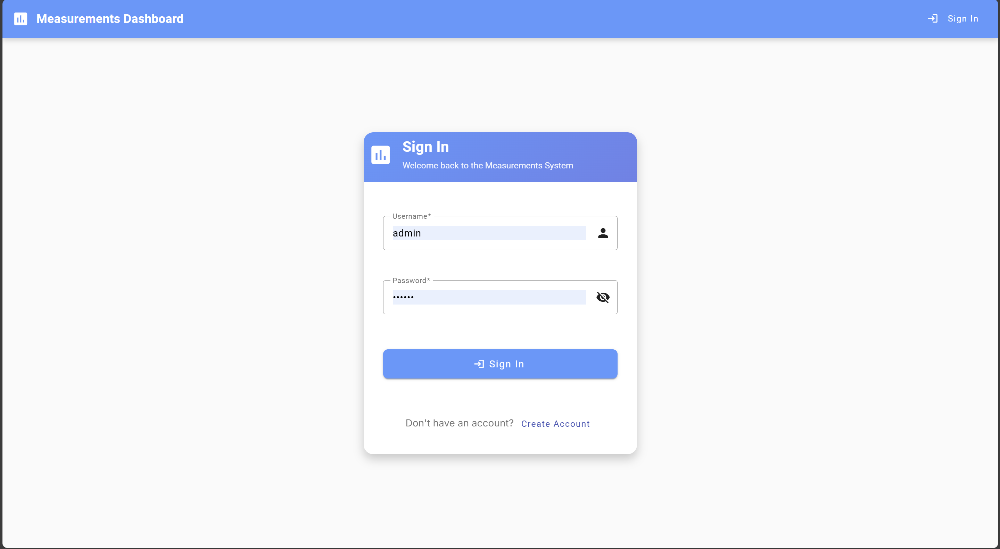
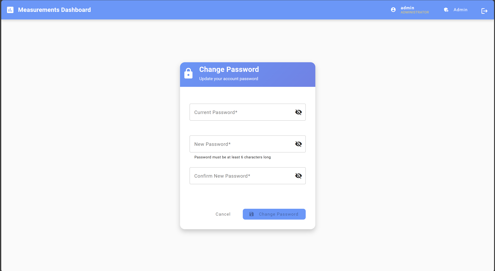
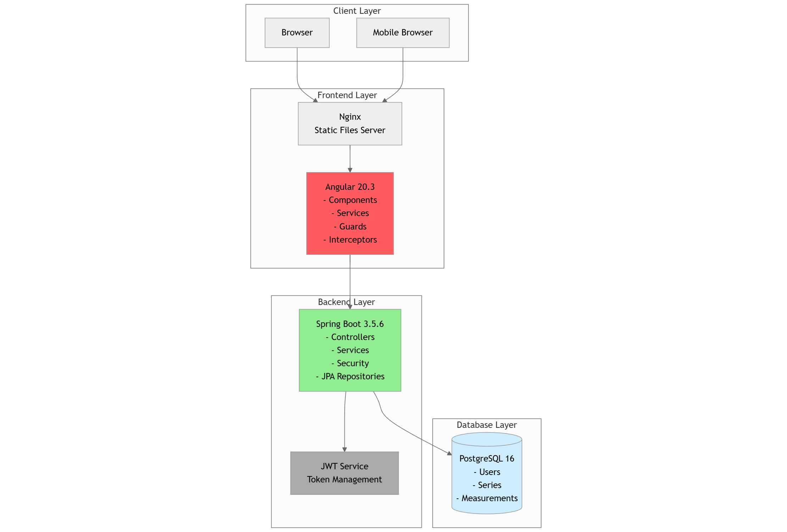
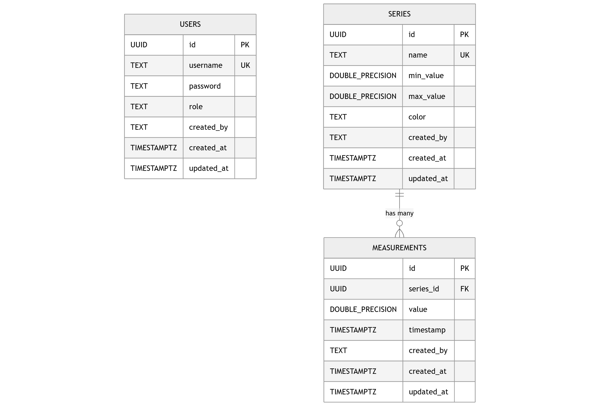
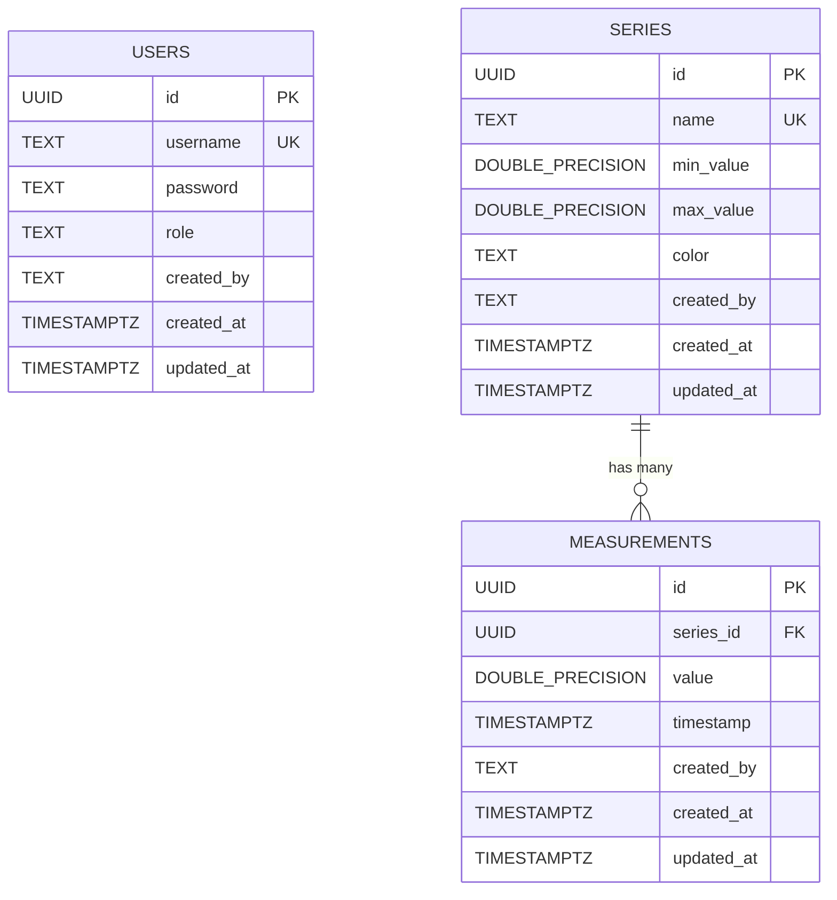
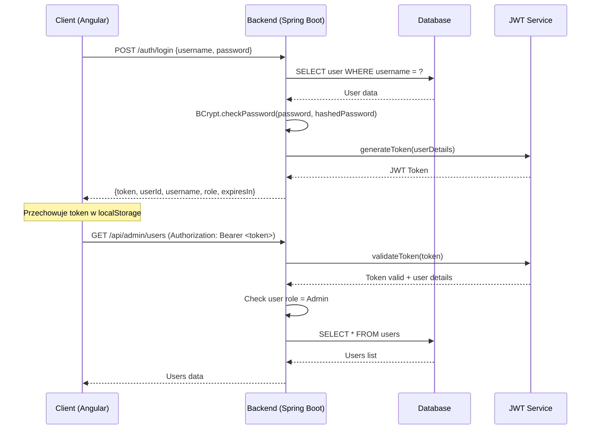

# System Zarządzania Pomiarami ZAIUZ - Dokumentacja Techniczna

## Spis treści

1. [Przegląd projektu](#przegląd-projektu)
2. [Funkcjonalności aplikacji](#funkcjonalności-aplikacji)
3. [Architektura systemu](#architektura-systemu)
4. [Technologie i narzędzia](#technologie-i-narzędzia)
5. [Model danych](#model-danych)
6. [API dokumentacja](#api-dokumentacja)
7. [Proces autoryzacji JWT](#proces-autoryzacji-jwt)
8. [Interfejs użytkownika](#interfejs-użytkownika)
9. [Uruchomienie lokalne](#uruchomienie-lokalne)

---

## Przegląd projektu

System ZAIUZ to nowoczesna aplikacja webowa do zarządzania danymi pomiarowymi IoT. Umożliwia zbieranie, przechowywanie i wizualizację pomiarów z różnych serii (temperatura, wilgotność itp.) z obsługą ról użytkowników oraz administracją danych.

### Główne cechy
- **Architektura**: Aplikacja trójwarstwowa (Frontend Angular + Backend Spring Boot + PostgreSQL)
- **Bezpieczeństwo**: Uwierzytelnianie JWT z rolami użytkowników
- **Wizualizacja**: Interaktywne wykresy w czasie rzeczywistym
- **Responsywność**: Interfejs przystosowany do urządzeń mobilnych
- **Konteneryzacja**: Pełne wsparcie Docker/Docker Compose

---

## Funkcjonalności aplikacji

### Dashboard główny


**Funkcjonalności:**
- Interaktywne wykresy liniowe pomiarów w czasie rzeczywistym
- Filtry czasowe (7 dni, 30 dni, 90 dni, okres niestandardowy)
- Selekcja serii pomiarowych do wyświetlenia
- Tabela danych z paginacją i sortowaniem
- Funkcja eksportu do druku
- Synchronizacja między wykresem a tabelą (kliknięcie punktu na wykresie podświetla odpowiedni wiersz)

### Uwierzytelnianie


**Funkcjonalności:**
- Formularz logowania z walidacją
- Uwierzytelnianie JWT
- Pamiętanie sesji użytkownika
- Automatyczne przekierowanie po uwierzytelnieniu

### Zmiana hasła


**Funkcjonalności:**
- Bezpieczna zmiana hasła dla zalogowanych użytkowników
- Walidacja obecnego hasła
- Wymagania dotyczące nowego hasła
- Potwierdzenie nowego hasła

### Panel administratora - Zarządzanie seriami


**Funkcjonalności:**
- Lista wszystkich serii pomiarowych
- Dodawanie nowych serii z kolorami i zakresami wartości
- Edycja istniejących serii
- Usuwanie serii (z kaskowaniem powiązanych pomiarów)
- Podgląd kolorów serii

### Panel administratora - Zarządzanie pomiarami


**Funkcjonalności:**
- Lista wszystkich pomiarów z paginacją
- Dodawanie nowych pomiarów z wyborem serii i datą
- Edycja istniejących pomiarów
- Usuwanie pomiarów
- Filtrowanie po seriach
- Sortowanie po wszystkich kolumnach

### Panel administratora - Zarządzanie użytkownikami


**Funkcjonalności:**
- Lista wszystkich użytkowników systemu
- Dodawanie nowych użytkowników z przypisaniem ról
- Edycja danych użytkowników
- Usuwanie użytkowników
- Zarządzanie rolami (User/Admin)
- Wizualne oznaczenie ról

---

## Architektura systemu

### Diagram architektury wysokiego poziomu

```mermaid
graph TB
    subgraph "Client Layer"
        Browser[Browser]
        Mobile[Mobile Browser]
    end
    
    subgraph "Frontend Layer"
        Angular[Angular 20.3<br/>- Components<br/>- Services<br/>- Guards<br/>- Interceptors]
        Nginx[Nginx<br/>Static Files Server]
    end
    
    subgraph "Backend Layer"
        SpringBoot[Spring Boot 3.5.6<br/>- Controllers<br/>- Services<br/>- Security<br/>- JPA Repositories]
        JWT[JWT Service<br/>Token Management]
    end
    
    subgraph "Database Layer"
        PostgreSQL[(PostgreSQL 16<br/>- Users<br/>- Series<br/>- Measurements)]
    end
    
    Browser --> Nginx
    Mobile --> Nginx
    Nginx --> Angular
    Angular --> SpringBoot
    SpringBoot --> JWT
    SpringBoot --> PostgreSQL
    
    style Angular fill:#dd2c00
    style SpringBoot fill:#6db33f
    style PostgreSQL fill:#336791
    style JWT fill:#000000
```



### Architektura komponentów

#### Frontend (Angular)
```
src/
├── app/
│   ├── features/
│   │   ├── dashboard/          # Dashboard główny
│   │   │   ├── components/
│   │   │   │   ├── chart/      # Komponenty wykresów
│   │   │   │   ├── data-table/ # Tabela danych
│   │   │   │   └── filter-bar/ # Pasek filtrów
│   │   │   └── dashboard.component.ts
│   │   ├── admin/              # Panel administratora
│   │   │   ├── components/
│   │   │   │   ├── series-form/      # Formularze serii
│   │   │   │   ├── series-table/     # Tabele serii
│   │   │   │   ├── measurement-form/ # Formularze pomiarów
│   │   │   │   ├── measurement-table/# Tabele pomiarów
│   │   │   │   ├── user-form/        # Formularze użytkowników
│   │   │   │   └── user-table/       # Tabele użytkowników
│   │   │   └── admin.component.ts
│   │   ├── auth/               # Uwierzytelnianie
│   │   └── change-password/    # Zmiana hasła
│   ├── services/               # Usługi HTTP
│   ├── guards/                 # Strażnicy tras
│   ├── interceptors/           # Interceptory HTTP
│   └── shared/                 # Komponenty współdzielone
```

#### Backend (Spring Boot)
```
src/main/java/com/zaiuz/mesurement/backend/
├── controllers/
│   ├── AuthController.java          # Uwierzytelnianie
│   ├── AdminController.java         # Operacje administracyjne
│   ├── MeasurementController.java   # API pomiarów
│   └── SeriesController.java        # API serii
├── domain/
│   ├── User.java                    # Encja użytkownika
│   ├── Series.java                  # Encja serii
│   ├── Measurement.java             # Encja pomiaru
│   └── dto/                         # Obiekty transferu danych
├── services/
│   ├── UserService.java             # Logika użytkowników
│   ├── SeriesService.java           # Logika serii
│   └── MeasurementService.java      # Logika pomiarów
├── repositories/
│   ├── UserRepository.java          # Repozytorium użytkowników
│   ├── SeriesRepository.java        # Repozytorium serii
│   └── MeasurementRepository.java   # Repozytorium pomiarów
└── security/
    ├── SecurityConfig.java          # Konfiguracja bezpieczeństwa
    ├── JwtService.java              # Usługa JWT
    └── JwtAuthFilter.java           # Filtr uwierzytelniania
```

---

## Technologie i narzędzia

### Backend
| Technologia | Wersja | Zastosowanie |
|------------|--------|--------------|
| **Java** | 21 | Język programowania |
| **Spring Boot** | 3.5.6 | Framework aplikacyjny |
| **Spring Security** | - | Bezpieczeństwo i uwierzytelnianie |
| **Spring Data JPA** | - | Mapowanie obiektowo-relacyjne |
| **JWT** | 0.11.2 | Tokeny uwierzytelniania |
| **PostgreSQL** | 16 | Baza danych |
| **Lombok** | - | Redukcja kodu boilerplate |
| **ModelMapper** | 3.0.0 | Mapowanie obiektów DTO |
| **SpringDoc OpenAPI** | 2.2.0 | Dokumentacja API (Swagger) |
| **Gradle** | - | Narzędzie budowy |

### Frontend
| Technologia | Wersja | Zastosowanie |
|------------|--------|--------------|
| **Angular** | 20.3.0 | Framework frontend |
| **TypeScript** | 5.9.2 | Język programowania |
| **Angular Material** | 20.2.9 | Komponenty UI |
| **Chart.js** | 4.5.1 | Wykresy i wizualizacje |
| **ng2-charts** | 8.0.0 | Integracja Chart.js z Angular |
| **RxJS** | 7.8.0 | Programowanie reaktywne |
| **date-fns** | 4.1.0 | Manipulacja dat |
| **jwt-decode** | 4.0.0 | Dekodowanie tokenów JWT |

### Infrastruktura
| Technologia | Wersja | Zastosowanie |
|------------|--------|--------------|
| **Docker** | - | Konteneryzacja |
| **Docker Compose** | - | Orkiestracja kontenerów |
| **Nginx** | - | Serwer WWW dla frontend |
| **PostgreSQL** | 16 | Baza danych produkcyjna |

---

## Model danych

### Diagram encji



### Opis tabel

#### Tabela `users`
| Kolumna | Typ | Opis |
|---------|-----|------|
| `id` | UUID | Klucz główny, generowany automatycznie |
| `username` | TEXT | Nazwa użytkownika (unikalna) |
| `password` | TEXT | Hasło zahashowane BCrypt |
| `role` | TEXT | Rola użytkownika: 'User' lub 'Admin' |
| `created_by` | TEXT | Użytkownik, który utworzył rekord |
| `created_at` | TIMESTAMPTZ | Data utworzenia |
| `updated_at` | TIMESTAMPTZ | Data ostatniej aktualizacji |

#### Tabela `series`
| Kolumna | Typ | Opis |
|---------|-----|------|
| `id` | UUID | Klucz główny, generowany automatycznie |
| `name` | TEXT | Nazwa serii (unikalna), np. 'Temperatura' |
| `min_value` | DOUBLE PRECISION | Minimalna oczekiwana wartość |
| `max_value` | DOUBLE PRECISION | Maksymalna oczekiwana wartość |
| `color` | TEXT | Kod koloru HEX dla wykresów |
| `created_by` | TEXT | Użytkownik, który utworzył rekord |
| `created_at` | TIMESTAMPTZ | Data utworzenia |
| `updated_at` | TIMESTAMPTZ | Data ostatniej aktualizacji |

#### Tabela `measurements`
| Kolumna | Typ | Opis |
|---------|-----|------|
| `id` | UUID | Klucz główny, generowany automatycznie |
| `series_id` | UUID | Klucz obcy do tabeli `series` |
| `value` | DOUBLE PRECISION | Wartość pomiaru |
| `timestamp` | TIMESTAMPTZ | Znacznik czasowy pomiaru |
| `created_by` | TEXT | Użytkownik, który utworzył rekord |
| `created_at` | TIMESTAMPTZ | Data utworzenia |
| `updated_at` | TIMESTAMPTZ | Data ostatniej aktualizacji |

### Indeksy i ograniczenia

```sql
-- Indeks złożony dla szybkich zapytań po seriach i czasie
CREATE INDEX idx_measurements_series_time ON measurements(series_id, timestamp);

-- Ograniczenie zakresu wartości
ALTER TABLE series ADD CONSTRAINT chk_range CHECK (max_value > min_value);

-- Klucz obcy z kaskadowaniem
ALTER TABLE measurements ADD CONSTRAINT fk_series
    FOREIGN KEY (series_id) REFERENCES series(id) ON DELETE CASCADE;
```

---

## API dokumentacja

### Endpointy uwierzytelniania

| Metoda | Endpoint | Opis | Autoryzacja |
|--------|----------|------|-------------|
| `POST` | `/auth/login` | Logowanie użytkownika | Brak |
| `POST` | `/auth/register` | Rejestracja użytkownika | Brak |
| `GET` | `/auth/me` | Informacje o bieżącym użytkowniku | JWT |
| `POST` | `/auth/change-password` | Zmiana hasła | JWT |
| `POST` | `/auth/logout` | Wylogowanie | JWT |

#### POST /auth/login
**Request:**
```json
{
  "username": "admin",
  "password": "password"
}
```

**Response (200):**
```json
{
  "token": "eyJhbGciOiJIUzI1NiJ9...",
  "type": "Bearer",
  "userId": "123e4567-e89b-12d3-a456-426614174000",
  "username": "admin",
  "role": "Admin",
  "expiresIn": 3600000
}
```

### Endpointy publiczne (Series)

| Metoda | Endpoint | Opis | Autoryzacja |
|--------|----------|------|-------------|
| `GET` | `/api/series` | Lista wszystkich serii | Brak |
| `GET` | `/api/series/{id}` | Szczegóły serii | Brak |

### Endpointy publiczne (Measurements)

| Metoda | Endpoint | Opis | Autoryzacja |
|--------|----------|------|-------------|
| `GET` | `/api/measurement` | Zapytanie o pomiary z filtrami | Brak |
| `GET` | `/api/measurement/{id}` | Szczegóły pomiaru | Brak |

#### GET /api/measurement
**Parametry zapytania:**
- `seriesIds` (optional): Lista UUID serii
- `from` (optional): Data rozpoczęcia (ISO 8601)
- `to` (optional): Data zakończenia (ISO 8601)
- `page` (optional): Numer strony (domyślnie 0)
- `size` (optional): Rozmiar strony (domyślnie 20)
- `sort` (optional): Sortowanie (np. "timestamp,desc")

**Response (200):**
```json
{
  "content": [
    {
      "id": "123e4567-e89b-12d3-a456-426614174000",
      "series": {
        "id": "456e7890-e89b-12d3-a456-426614174000",
        "name": "Temperatura",
        "color": "#F44336"
      },
      "value": 23.5,
      "timestamp": "2024-11-08T10:30:00Z"
    }
  ],
  "pageable": {
    "pageNumber": 0,
    "pageSize": 20,
    "sort": {
      "sorted": true,
      "orderBy": "timestamp"
    }
  },
  "totalElements": 150,
  "totalPages": 8,
  "last": false
}
```

### Endpointy administracyjne (wymagana rola Admin)

| Metoda | Endpoint | Opis | Autoryzacja |
|--------|----------|------|-------------|
| `POST` | `/api/admin/series` | Tworzenie serii | JWT + Admin |
| `PUT` | `/api/admin/series/{id}` | Aktualizacja serii | JWT + Admin |
| `DELETE` | `/api/admin/series/{id}` | Usuwanie serii | JWT + Admin |
| `POST` | `/api/admin/measurements` | Tworzenie pomiaru | JWT + Admin |
| `PUT` | `/api/admin/measurements/{id}` | Aktualizacja pomiaru | JWT + Admin |
| `DELETE` | `/api/admin/measurements/{id}` | Usuwanie pomiaru | JWT + Admin |
| `GET` | `/api/admin/users` | Lista użytkowników | JWT + Admin |
| `POST` | `/api/admin/users` | Tworzenie użytkownika | JWT + Admin |
| `PUT` | `/api/admin/users/{id}` | Aktualizacja użytkownika | JWT + Admin |
| `DELETE` | `/api/admin/users/{id}` | Usuwanie użytkownika | JWT + Admin |

#### POST /api/admin/series
**Request:**
```json
{
  "name": "Ciśnienie",
  "minValue": 900.0,
  "maxValue": 1100.0,
  "color": "#4CAF50"
}
```

#### POST /api/admin/measurements
**Request:**
```json
{
  "seriesId": "456e7890-e89b-12d3-a456-426614174000",
  "value": 25.3,
  "timestamp": "2024-11-08T12:00:00Z"
}
```

### Kody odpowiedzi HTTP

| Kod | Znaczenie | Przykład użycia |
|-----|-----------|-----------------|
| `200` | OK | Pomyślne pobranie danych |
| `201` | Created | Pomyślne utworzenie zasobu |
| `204` | No Content | Pomyślne usunięcie zasobu |
| `400` | Bad Request | Błędne dane wejściowe |
| `401` | Unauthorized | Brak autoryzacji |
| `403` | Forbidden | Brak uprawnień |
| `404` | Not Found | Zasób nie istnieje |
| `409` | Conflict | Konflikt danych (np. duplikat username) |
| `500` | Internal Server Error | Błąd serwera |

---

## Proces autoryzacji JWT

### Diagram przepływu uwierzytelniania




### Struktura tokena JWT

**Header:**
```json
{
  "alg": "HS256",
  "typ": "JWT"
}
```

**Payload:**
```json
{
  "sub": "admin",
  "roles": ["Admin"],
  "iat": 1699459200,
  "exp": 1699462800
}
```

**Signature:**
```
HMACSHA256(
  base64UrlEncode(header) + "." +
  base64UrlEncode(payload),
  secret_key
)
```

### Implementacja bezpieczeństwa

#### Konfiguracja Spring Security
```java
@Configuration
@EnableWebSecurity
@EnableMethodSecurity
public class SecurityConfig {
    
    @Bean
    public SecurityFilterChain filterChain(HttpSecurity http) throws Exception {
        http
            .csrf(csrf -> csrf.disable())
            .authorizeHttpRequests(auth -> auth
                .requestMatchers("/auth/**").permitAll()
                .requestMatchers("/api/series/**").permitAll()
                .requestMatchers("/api/measurement/**").permitAll()
                .requestMatchers("/api/admin/**").hasAuthority("Admin")
                .anyRequest().authenticated()
            )
            .sessionManagement(session -> 
                session.sessionCreationPolicy(SessionCreationPolicy.STATELESS))
            .addFilterBefore(jwtAuthFilter, UsernamePasswordAuthenticationFilter.class);
        
        return http.build();
    }
}
```

#### Filtr JWT
```java
@Component
public class JwtAuthFilter extends OncePerRequestFilter {
    
    @Override
    protected void doFilterInternal(HttpServletRequest request, 
                                  HttpServletResponse response, 
                                  FilterChain filterChain) throws ServletException, IOException {
        String authHeader = request.getHeader("Authorization");
        
        if (authHeader != null && authHeader.startsWith("Bearer ")) {
            String jwt = authHeader.substring(7);
            String username = jwtService.extractUsername(jwt);
            
            if (username != null && SecurityContextHolder.getContext().getAuthentication() == null) {
                UserDetails userDetails = userDetailsService.loadUserByUsername(username);
                
                if (jwtService.isTokenValid(jwt, userDetails)) {
                    UsernamePasswordAuthenticationToken authToken = 
                        new UsernamePasswordAuthenticationToken(userDetails, null, userDetails.getAuthorities());
                    SecurityContextHolder.getContext().setAuthentication(authToken);
                }
            }
        }
        
        filterChain.doFilter(request, response);
    }
}
```

#### Angular Auth Guard
```typescript
@Injectable({
  providedIn: 'root'
})
export class AuthGuard implements CanActivate {
  
  canActivate(route: ActivatedRouteSnapshot): boolean {
    const requiredRole = route.data['role'];
    
    if (!this.authService.isAuthenticated()) {
      this.router.navigate(['/auth/login']);
      return false;
    }
    
    if (requiredRole && !this.authService.hasRole(requiredRole)) {
      this.router.navigate(['/dashboard']);
      return false;
    }
    
    return true;
  }
}
```

#### HTTP Interceptor
```typescript
@Injectable()
export class AuthInterceptor implements HttpInterceptor {
  
  intercept(req: HttpRequest<any>, next: HttpHandler): Observable<HttpEvent<any>> {
    const token = this.authService.getToken();
    
    if (token && !req.url.includes('/auth/')) {
      const authReq = req.clone({
        setHeaders: {
          Authorization: `Bearer ${token}`
        }
      });
      return next.handle(authReq);
    }
    
    return next.handle(req);
  }
}
```

---

## Interfejs użytkownika

### Routing aplikacji

```typescript
export const routes: Routes = [
  { path: '', redirectTo: '/dashboard', pathMatch: 'full' },
  { path: 'dashboard', loadComponent: () => import('./features/dashboard/dashboard.component') },
  { path: 'admin', loadComponent: () => import('./features/admin/admin.component'), 
    canActivate: [AuthGuard], data: { role: 'Admin' } },
  { path: 'change-password', loadComponent: () => import('./features/change-password/change-password.component'), 
    canActivate: [AuthGuard] },
  { path: 'auth/login', loadComponent: () => import('./features/auth/login/login.component') }
];
```

### Architektura komponentów Angular

#### Standalone Components
Wszystkie komponenty wykorzystują nową architekturę standalone Angular 20:

```typescript
@Component({
  selector: 'app-dashboard',
  imports: [
    CommonModule,
    MatCardModule,
    FilterBarComponent,
    ChartComponent,
    DataTableComponent
  ],
  templateUrl: './dashboard.component.html',
  styleUrls: ['./dashboard.component.scss']
})
export class DashboardComponent {
  // Wykorzystanie signals dla reaktywnego zarządzania stanem
  selectedMeasurement = signal<Measurement | null>(null);
  currentFilters = signal<FilterOptions>({...});
}
```

#### Reactive Forms
```typescript
ngOnInit(): void {
  this.userForm = this.fb.group({
    username: ['', [Validators.required, Validators.minLength(3)]],
    password: ['', [Validators.required, Validators.minLength(6)]],
    role: ['User', Validators.required]
  });
}
```

#### Angular Signals
```typescript
// Zarządzanie stanem z signals
isAuthenticated = signal<boolean>(this.hasValidToken());
currentUser = signal<User | null>(this.getUserFromStorage());
isAdmin = signal<boolean>(this.checkIsAdmin());

// Computed signals
canAccessAdmin = computed(() => this.isAdmin() && this.isAuthenticated());
```

### Material Design
Aplikacja wykorzystuje Angular Material 20.2.9 dla spójnego UI:

- **Mat-Card**: Karty zawierające wykresy i tabele
- **Mat-Table**: Tabele z sortowaniem i paginacją
- **Mat-Form-Field**: Pola formularzy z walidacją
- **Mat-Button**: Przyciski akcji
- **Mat-Dialog**: Dialogi potwierdzenia
- **Mat-Snackbar**: Powiadomienia
- **Mat-Tabs**: Zakładki w panelu admina
- **Mat-Toolbar**: Paski narzędzi

---

## Uruchomienie lokalne

### Wymagania systemowe

- **Docker** 20.10+ i **Docker Compose** 2.0+
- **Node.js** 18+ (dla rozwoju frontend)
- **Java** 21 (dla rozwoju backend)
- **Git** (do klonowania repozytorium)

### Uruchomienie z Docker Compose (zalecane)

1. **Klonowanie repozytorium**
```bash
git clone <repository-url>
cd ZAIUZ
```

2. **Konfiguracja środowiska**
```bash
cd ops
cp .env.example .env  # Utwórz plik .env
```

3. **Przykładowy plik .env**
```bash
# Database
POSTGRES_DB=measurements_db
POSTGRES_USER=user
POSTGRES_PASSWORD=secure_password

# JWT
JWT_SECRET_KEY=your_jwt_secret_key_here_at_least_256_bits
JWT_EXPIRATION_TIME=3600000

# Ports
BACKEND_PORT=8080
FRONTEND_PORT=3000
PG_PORT=5433

# CORS
FRONTEND_ORIGIN=http://localhost:3000
```

4. **Uruchomienie aplikacji**
```bash
docker-compose up --build -d
```

5. **Weryfikacja działania**
- Frontend: http://localhost:3000
- Backend API: http://localhost:8080
- Swagger UI: http://localhost:8080/swagger-ui.html
- Database: localhost:5433

6. **Domyślne konta użytkowników**
- Admin: `admin` / `password`
- User: `user` / `password`

### Rozwój lokalny

#### Backend (Spring Boot)

1. **Uruchomienie bazy danych**
```bash
docker run --name measurements-db \
  -e POSTGRES_DB=measurements_db \
  -e POSTGRES_USER=user \
  -e POSTGRES_PASSWORD=password \
  -p 5433:5432 \
  -v $(pwd)/ops/db/init.sql:/docker-entrypoint-initdb.d/01_init.sql:ro \
  -d postgres:16
```

2. **Konfiguracja application.properties**
```properties
spring.datasource.url=jdbc:postgresql://localhost:5433/measurements_db
spring.datasource.username=user
spring.datasource.password=password
```

3. **Uruchomienie aplikacji**
```bash
cd backend
./gradlew bootRun

# Lub na Windows
gradlew.bat bootRun
```

4. **Weryfikacja**
- API: http://localhost:8080
- Swagger: http://localhost:8080/swagger-ui.html
- Health: http://localhost:8080/actuator/health

#### Frontend (Angular)

1. **Instalacja zależności**
```bash
cd frontend
npm install
```

2. **Uruchomienie serwera deweloperskiego**
```bash
ng serve
# lub
npm start
```

3. **Weryfikacja**
- Aplikacja: http://localhost:4200
- Automatyczne przeładowanie przy zmianach

### Budowanie produkcyjne

#### Backend
```bash
cd backend
./gradlew build
java -jar build/libs/backend-0.0.1-SNAPSHOT.jar
```

#### Frontend
```bash
cd frontend
ng build --configuration production
# Pliki w folderze dist/
```

### Rozwiązywanie problemów

#### Port zajęty
```bash
# Sprawdź używane porty
netstat -tulpn | grep :8080
netstat -tulpn | grep :3000
netstat -tulpn | grep :5433

# Zatrzymaj konfliktujące usługi lub zmień porty w .env
```

#### Problemy z bazą danych
```bash
# Sprawdź logi bazy danych
docker logs measurements-db

# Resetuj bazę danych
docker-compose down -v
docker-compose up --build -d
```

#### Problemy z kontenerami
```bash
# Sprawdź status kontenerów
docker ps -a

# Sprawdź logi
docker logs measurements-backend
docker logs measurements-frontend

# Przebuduj obrazy
docker-compose down
docker-compose build --no-cache
docker-compose up -d
```

#### Czyszczenie środowiska
```bash
# Zatrzymaj wszystkie kontenery
docker-compose down -v

# Usuń obrazy
docker rmi $(docker images -q "*measurements*")

# Usuń wolumeny
docker volume prune
```

### Testowanie

#### Backend
```bash
cd backend
./gradlew test
```

#### Frontend
```bash
cd frontend
npm test
```

#### API (Postman/curl)
```bash
# Login
curl -X POST http://localhost:8080/auth/login \
  -H "Content-Type: application/json" \
  -d '{"username":"admin","password":"password"}'

# Użyj zwróconego tokena
curl -X GET http://localhost:8080/api/admin/users \
  -H "Authorization: Bearer YOUR_TOKEN_HERE"
```

---

## Monitoring i obsługa

### Health Checks
Aplikacja zawiera wbudowane kontrole stanu:

- Backend: `/actuator/health`
- Docker health checks w docker-compose.yml
- Kontrole połączenia z bazą danych

### Logowanie
- Backend: Logi Spring Boot (console + pliki)
- Frontend: Browser DevTools console
- Nginx: Access/error logs

### Backup bazy danych
```bash
# Eksport danych
docker exec measurements-db pg_dump -U user measurements_db > backup.sql

# Import danych
docker exec -i measurements-db psql -U user measurements_db < backup.sql
```

---

*Dokumentacja wygenerowana dla systemu ZAIUZ v1.0*
*Ostatnia aktualizacja: Listopad 2024*